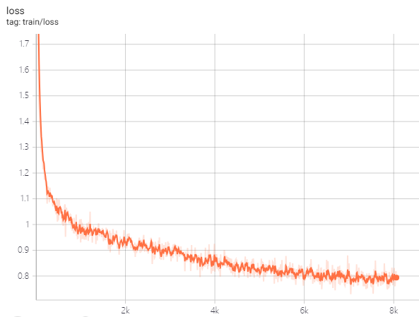
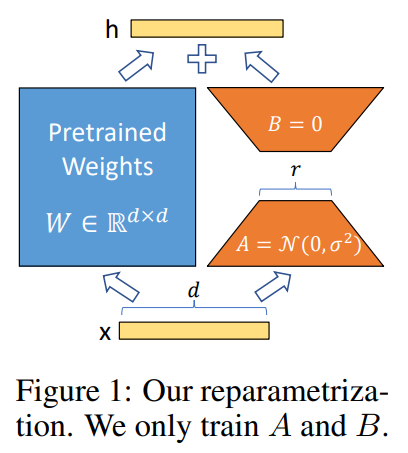
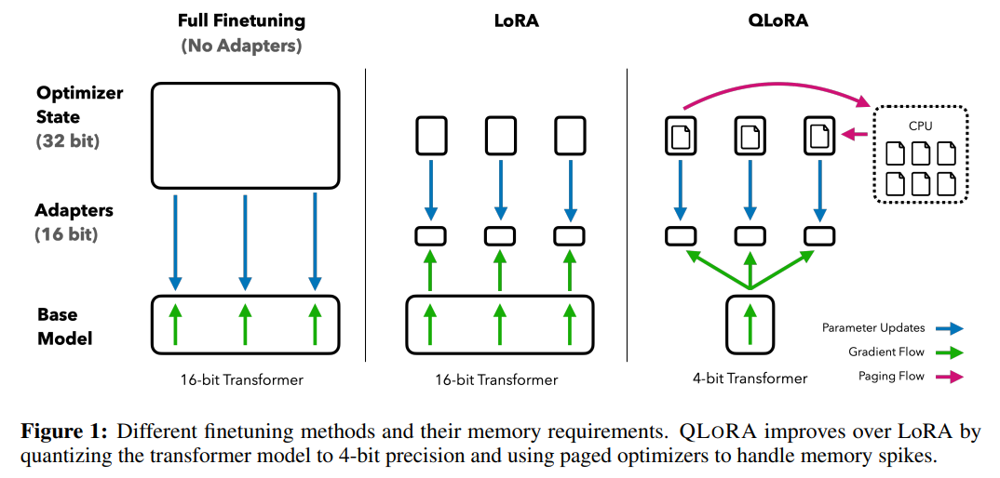
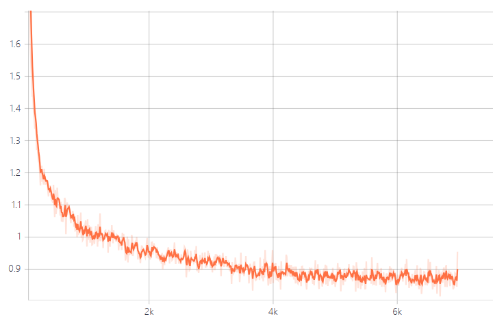

# 😄 LLMTuner: 大语言模型指令调优工具（支持全量参数微调、LoRA 和 QLoRA）

## 🔄 News

- [2023/06/20] QLoRA 微调过程中的显存占用分析

- [2023/06/16] 开源在 12w 条多轮对话数据上全量参数微调得到的 [bloom-3b-moss-chat](https://huggingface.co/WangZeJun/bloom-3b-moss-chat) 

- [2023/06/16] 使用 QLoRA 技术，在 12w 条多轮对话数据上微调得到的 [bloomz-7b1-qlora-moss-chat](https://huggingface.co/WangZeJun/bloomz-7b1-qlora-moss-chat)  

- [2023/06/16] 开源全量参数训练、LoRA 和 QLoRA 训练代码。

## 📝 项目简介

LLMTuner 是一个支持全量参数微调、LoRA 和 QLoRA 的大语言模型指令调优工具。在训练中可以结合词表裁剪、DeepSpeed-ZeRO、gradient checkpointing、4-bit 量化等技术，有效降低显存占用，实现在单张消费级显卡上微调 7B/13B/33B 大模型。

我们从 MOSS 项目开源的中英文指令微调数据集 [moss-003-sft-data](https://huggingface.co/datasets/fnlp/moss-003-sft-data) 中抽取 12w 条多轮对话数据作为训练数据，分别：

- 以词表裁剪后的 [bloom-3b](https://huggingface.co/YeungNLP/bloom-2b6-zh) 为基座，全量参数微调得到 [bloom-3b-moss-chat](https://huggingface.co/WangZeJun/bloom-3b-moss-chat)

- 以词表裁剪后的 [bloomz-7b1-mt](https://huggingface.co/YeungNLP/bloomz-6b4-mt-zh) 为基座，使用 QLoRA 技术微调得到 [bloomz-7b1-qlora-moss-chat](https://huggingface.co/WangZeJun/bloomz-7b1-qlora-moss-chat)

## 📫 Requirements

- bitsandbytes==0.39.0

- sentencepiece==0.1.99

- transformers @ git+https://github.com/huggingface/transformers.git

- peft @ git+https://github.com/huggingface/peft.git

- accelerate @ git+https://github.com/huggingface/accelerate.git

- tensorboardX

```shell
pip install -U -r requirements.txt
```

## 📊 训练数据

训练数据中的单条指令需要预处理为如下形式：

```json
{
    "conversation_id": 4, 
    "category": "Brainstorming", 
    "num_turns": 4, 
    "conversation": [
        {
            "human": "如何制定一个有效的网页设计？", 
            "assistant": "\n\n要制定一个有效的网页设计，需要考虑以下几个方面：\n\n1. 目标受众：确定您的目标受众是谁，这将有助于您决定网站的设计和内容。\n\n2. 清晰的布局：网站的布局应该简单，易于使用和导航。所有元素应该有明确的标识和位置，以便用户快速找到他们需要的信息。\n\n3. 吸引人的视觉效果：网站的设计应该吸引人，使用清晰的图像、颜色和字体。但同时也要确保视觉效果不会影响网站的性能和导航。\n\n4. 有效的内容：网站的内容应该有价值，易于理解和使用。使用简单的语言和段落，避免使用过于复杂的术语和语言。\n\n5. 可访问性：网站应该易于访问，即使是对于有视觉或听力障碍的用户。确保网站符合标准的可访问性要求。\n\n6. 响应式设计：网站应该是响应式的，即适合各种不同尺寸的设备。这将确保用户在不同设备上都能够访问和使用您的网站。\n\n通过考虑这些方面，您可以制定一个有效的网页设计，吸引并留住您的受众，并提高您的网站的成功率。"
        }, 
        {
            "human": "哪些因素会影响网站的性能？", 
            "assistant": "网站的性能受许多因素的影响，以下是一些主要的因素：\n\n1. 服务器性能：网站的速度和性能取决于服务器的性能，包括硬件、软件、配置和网络连接速度。\n\n2. 图片和媒体文件的大小：大尺寸的图片和媒体文件会增加网站的加载时间，因此需要使用适当的图片和媒体文件大小，以确保网站可以快速加载。\n\n3. 代码优化：网站的代码应尽可能简洁和优化，以确保它在加载和运行时的速度最快。\n\n4. 缓存和压缩：使用缓存和压缩技术可以大大提高网站的性能，因为它们可以减少文件大小和加载时间。\n\n5. 第三方插件和脚本：第三方插件和脚本可能会减慢网站的速度，因此需要谨慎选择并仅使用必要的插件和脚本。\n\n6. 浏览器兼容性：网站应该在各种不同的浏览器上兼容，因为不同的浏览器可能会以不同的方式解释代码并表现出不同的性能。\n\n7. 网络连接速度：用户的网络连接速度也会影响网站的性能，如果用户的网络连接速度较慢，网站的加载时间可能会更长。\n\n总之，要提高网站的性能，需要优化服务器、代码和媒体文件，使用缓存和压缩技术，谨慎使用第三方插件和脚本，并考虑用户的网络连接速度和浏览器兼容性。"
        }, 
        {
            "human": "如何确定网站的目标受众？", 
            "assistant": "确定网站的目标受众是成功的关键之一，以下是确定目标受众的一些步骤：\n\n1. 考虑您的业务：首先，您需要考虑您的业务或服务类型，以及您想要吸引的客户或用户类型。比如，如果您是一家专门从事儿童玩具销售的公司，您的目标受众可能是父母或祖父母。\n\n2. 调查市场：进行市场调查，了解您的目标受众的需求、喜好、行为和偏好。您可以使用各种市场调查技术，如在线调查、焦点小组讨论等等。\n\n3. 竞争分析：研究竞争对手的网站，了解他们的目标受众、品牌声誉和营销策略。\n\n4. 客户反馈：收集客户反馈，了解他们对您网站的看法，以及您的网站是否满足他们的需求和期望。\n\n5. 利用分析工具：使用分析工具（如Google Analytics）了解您的网站的访问者特征，比如年龄、性别、地理位置等，从而了解您的目标受众。\n\n综上所述，确定网站的目标受众需要考虑您的业务类型、市场调查、竞争分析、客户反馈和分析工具。这些步骤可以帮助您更好地了解您的目标受众，从而制定更好的网站设计和营销策略。"
        }, 
        {
            "human": "如何在网站上提供更好的用户体验？", 
            "assistant": "提供更好的用户体验是一个成功的网站设计的关键。以下是一些提高网站用户体验的方法：\n\n1. 清晰的页面布局：网站应该有清晰的页面布局，易于使用和导航。所有元素应该有明确的标识和位置，以便用户快速找到他们需要的信息。\n\n2. 易于理解和使用的导航：网站的导航应该简单、明确和易于理解。用户应该能够快速找到他们需要的信息，而不必浪费时间在网站上寻找。\n\n3. 快速的网站加载速度：网站的加载速度是提供良好用户体验的关键因素之一。网站应该尽可能快地加载，以避免用户等待过长的时间。\n\n4. 响应式设计：网站应该是响应式的，即适合各种不同尺寸的设备。这将确保用户在不同设备上都能够访问和使用您的网站。\n\n5. 良好的内容：网站的内容应该有价值，易于理解和使用。使用简单的语言和段落，避免使用过于复杂的术语和语言。\n\n6. 与用户互动：网站应该与用户互动，以吸引和留住用户。例如，您可以添加评论部分、交互式表单和调查等功能。\n\n7. 提供搜索功能：对于较大的网站，提供搜索功能可以帮助用户快速找到他们需要的信息。\n\n8. 避免繁琐的注册流程：网站应该尽可能避免繁琐的注册流程，以避免阻碍用户的使用。\n\n9. 优化网站的可访问性：网站应该易于访问，即使是对于有视觉或听力障碍的用户。确保网站符合标准的可访问性要求。\n\n总之，提供更好的用户体验需要考虑页面布局、导航、加载速度、响应式设计、内容、互动、搜索功能、注册流程和可访问性。通过优化这些方面，您可以提高用户满意度，增加用户留存率，并提高您的网站的成功率。"
        }
    ]
}
```

## 🚀 全量参数微调

基于 DeepSpeed ZeRO Stage 3 的单卡训练：

```shell
deepspeed --include localhost:0 train.py \
    --model_name_or_path /path/to/bloom \
    --data_path data/train.jsonl \
    --output_dir output/bloom-3b-moss-chat/ \
    --max_length 1024 \
    --per_device_train_batch_size 4 \
    --gradient_accumulation_steps 4 \
    --learning_rate 2e-5 \
    --num_train_epochs 1 \
    --lr_scheduler_type "cosine" \
    --warmup_steps 500 \
    --logging_steps 10 \
    --save_strategy "steps" \
    --save_steps 500 \
    --save_total_limit 1 \
    --report_to "tensorboard" \
    --bf16 True \
    --tf32 True \
    --deepspeed data/deepspeed.json
```

设置 `max_length=1024, batch_size=16, bf16=True`，单卡需要约 45G 显存对词表裁剪后的 bloom-3b 基座进行全量参数微调，在 12w 多轮对话数据集上训练了一个 epoch（大约 8000 steps），训练过程中的 loss 变化如下：



## 🚀 LoRA

[LoRA](https://github.com/microsoft/LoRA) 的核心思想是冻结预训练模型权重，将可训练的秩分解矩阵注入 Transformer 架构的每一层，从而大大减少了下游任务的微调参数量。



LoRA 的实现流程概述如下：

- 在原始预训练语言模型 (PLM) 旁增加一个旁路，做一个先降维再升维的操作，以此来模拟所谓的本征秩 (intrinsic rank)；

- 训练的时候固定 PLM 的参数不变，只训练降维矩阵 A 和升维矩阵 B，即优化器只优化右路的参数；

- 模型的输入、输出维度不变，左右两边共用模型的输入，输出时将 PLM 与旁路的输出叠加：h=Wx+BAx

- 用零均值随机高斯分布初始化 A，用全零矩阵初始化 B。矩阵 B 的全零初始化，使得在训练最开始的一段时间，右路的结果会接近于0，这样模块的输出就基本上来自于左路，也就是大模型原有参数的计算结果，这使得模型优化的初始点和原始的大模型保持一致。

使用 LoRA 进行单卡训练：

```shell
python train_lora.py \
    --model_type bloom
    --model_name_or_path /path/to/bloom \
    --data_path data/train.jsonl \
    --output_dir output/bloomz-7b1-lora-moss-chat \
    --max_length 1024 \
    --per_device_train_batch_size 4 \
    --gradient_accumulation_steps 4 \
    --max_grad_norm 0.3 \
    --learning_rate 2e-4 \
    --num_train_epochs 1 \
    --lr_scheduler_type "cosine" \
    --warmup_steps 500 \
    --logging_steps 10 \
    --save_strategy "steps" \
    --save_steps 500 \
    --save_total_limit 1 \
    --report_to "tensorboard" \
    --gradient_checkpointing True \
    --lora_r 64 \
    --lora_alpha 16 \
    --lora_dropout 0.05 \
    --int8_training True
```

```text
trainable params: 31,457,280 || all params: 6,261,878,784 || trainable%: 0.5023616886417199
```


## 🚀 QLoRA

[QLoRA](https://github.com/artidoro/qlora) 是一种高效的微调方法，可以在保持完整的16位微调任务性能下，实现单个 48GB GPU 上微调 65B 参数量模型。QLoRA 通过冻结的 4-bit 量化预训练语言模型向低秩适配器(LoRA) 反向传播梯度。使用 4-bit NormalFloat (NF4) 量化、Double Quantization、Paged Optimizers、所有 Linear 层插入 adapter 等技术，QLoRA 在不牺牲性能的情况下大大节省了显存占用。具体说明如下：

- <b>4bit NormalFloat（NF4）</b>：对于正态分布权重而言，一种信息理论上最优的新数据类型，该数据类型对于正态分布数据可以产生比 4 bit 整数和 4bit 浮点数更好的实证结果。
- <b>Double Quantization</b>：对第一次量化后的那些常量再进行一次量化，减少存储空间。
- <b>Paged Optimizers</b>：使用 NVIDIA 统一内存特性，实现了 CPU 和 GPU 之间自动的页面转换。当 GPU 内存不足时，Paged Optimizers 技术会自动将优化器状态转移到 CPU 内存，以确保优化器的正常运行。
- <b>All-Linear-Layer-Adapter</b>：在所有全连接层都插入 LoRA Adapter，增加了训练参数，能匹配16位全参数微调的性能。



使用 QLoRA 进行单卡训练：

```shell
python train_qlora.py \
    --model_name_or_path /path/to/bloom \
    --data_path data/train.jsonl \
    --output_dir output/bloomz-7b1-qlora-moss-chat \
    --max_length 1024 \
    --per_device_train_batch_size 4 \
    --gradient_accumulation_steps 4 \
    --max_grad_norm 0.3 \
    --learning_rate 2e-4 \
    --num_train_epochs 1 \
    --lr_scheduler_type "cosine" \
    --warmup_steps 500 \
    --logging_steps 10 \
    --save_strategy "steps" \
    --save_steps 500 \
    --save_total_limit 1 \
    --report_to "tensorboard" \
    --bf16 True \
    --tf32 True \
    --gradient_checkpointing True \
    --optim "paged_adamw_32bit" \
    --lora_r 64 \
    --lora_alpha 16 \
    --lora_dropout 0.05 \
    --bits 4 \
    --double_quant True \
    --quant_type "nf4"
```

以词表裁剪后的 bloomz-7b1-mt 为基座，在上面参数配置下，单卡仅需要约 12G 显存便可进行 QLoRA 微调。由于 QLoRA 在所有的全连接层处都插入了 Adapter，相同 `lora_r=64` 下其可训练的参数量多于 LoRA：

```
trainable params: 125,829,120 || all params: 3,336,351,744 || trainable%: 3.7714584568694685
```

在 12w 多轮对话数据集上训练了一个 epoch（大约 8000 steps），训练过程中的 loss 变化如下：



## 🚀 显存分析

使用 QLoRA 微调词表裁剪后的 bloomz-7b1-mt 基座，`batch_size=1, bf16=True`，NF4 和双量化策略下不同配置需要的显存资源如下：

| lora_r | max_length | gradient_checkpointing | memory |
| ------ | ---------- | ---------------------- | ------ |
| 32     | 512        | true                   | 6G     |
| 32     | 512        | false                  | 12G    |
| 32     | 1024       | true                   | 7G     |
| 32     | 1024       | false                  | 21G    |
| 64     | 512        | true                   | 7G     |
| 64     | 512        | false                  | 13G    |
| 64     | 1024       | true                   | 8G     |
| 64     | 1024       | false                  | 22G    |


## 📚 生成效果

#### [bloom-3b-moss-chat](https://huggingface.co/WangZeJun/bloom-3b-moss-chat)

命令行单轮对话：

```shell
python chat.py \
    --model_name_or_path /path/to/model \
    --top_p 0.85 \
    --temperature 0.3 \
    --max_new_tokens 512 \
    --repetition_penalty 1.2
```

添加 `--multi_round` 可开启多轮对话。

<details><summary><b>单轮对话</b></summary>

| 输入                                                                                                                                                                | 输出                                                                                                                                          |
|-------------------------------------------------------------------------------------------------------------------------------------------------------------------|---------------------------------------------------------------------------------------------------------------------------------------------|
| 如何成为一个全栈工程师？  | 成为一名全栈工程师需要具备以下技能和知识：<br><br>1. 编程语言基础：熟练掌握至少一种编程语言，如Java、Python等。<br>2. 数据结构和算法：了解常见的数据结构（如数组、链表等）以及算法的基本原理和使用方法。<br>3. 网络通信与Web开发：熟悉HTTP协议、TCP/IP协议、网络安全等方面的知识和应用场景。<br>4. 前端技术：学习HTML/CSS/JavaScript等前端技术的实现方法和常用框架（如React、Vue.js）。<br>5. 后端技术：熟悉常见的后端技术和框架（如Node.js、Django、Ruby on Rails）等的使用方法和性能优化技巧。<br>6. 项目管理能力：在项目中能够有效地组织和协调团队成员的工作，并负责项目的进度和资源分配等工作。<br>7. 持续学习的能力：保持对新技术和工具的敏感度和好奇心，不断更新自己的知识和技能。 |
|我想系统地学习机器学习，能为我提供一些建议吗|当然可以！以下是一些建议：<br><br>1. 了解基础知识：首先需要掌握数学、统计学和编程等基本概念。这些课程可以帮助你理解机器学习的原理和应用。<br><br>2. 选择合适的教材：在选择教材时，应该考虑自己的水平和能力以及所学领域的实际需求。例如，如果你已经熟悉了Python语言和一些基本的线性代数和微积分，那么可以选择《机器学习》（周志华著）这样的教材进行深入学习。<br><br>3. 参加在线课程或培训班：现在有很多优秀的在线课程和培训机构提供了机器学习相关的课程，如Coursera、Udacity、edX等等。你可以根据自己的时间和预算来选择适合的平台。<br><br>4. 实践项目：通过参加比赛或者自己动手完成小型的数据集训练模型，可以让你在实践中加深对机器学习的理解和提高技能。<br><br>5. 与同行交流：与其他从事机器学习的人建立联系并参与讨论，可以让你更好地理解行业趋势和技术发展方向，同时也可以获得更多的反馈和建议。<br><br>希望这些建议能够帮助到你开始你的机器学习之旅！|
|写一首关于秋天的诗|秋天来了，枫叶红，<br>落日西斜，天空湛蓝。<br>金黄的稻穗在田野里摇曳，<br>微风吹拂着树叶的声音响起。<br><br>小溪流淌，河水清澈见底，<br>鱼儿游动，欢快地嬉戏玩耍。<br>远处的山峰被云雾笼罩，<br>仿佛在向我们招手致意。<br><br>夜晚来临，星空闪耀光芒，<br>月亮高挂在天空中。风中传来鸟儿的歌唱，<br>让人感到无限温馨和宁静。<br><br>秋天的美景如此迷人，<br>让我们感受到生命的美好与温暖。<br>愿我们的心灵也像这美丽的季节一样，<br>充满爱、希望和美好。|
|根据标题生成一篇文章，要求400字：全面推进乡村振兴 加快建设农业强国|近年来，我国农村发展取得了显著成效。然而，城乡差距依然存在，农民收入水平低、生活质量差等问题仍然存在。为了实现乡村振兴和农业现代化，我们必须采取一系列措施。<br><br>首先，要加强基础设施建设。在农村地区，道路、水利设施等基础条件非常重要。政府应该加大对农村地区的投资力度，提高基础设施的覆盖率和完善程度，让农民能够更加便捷地出行和生产。<br><br>其次，要推动现代农业和产业升级。随着科技的发展和社会的变革，农业生产方式也在不断变化。政府和企业可以共同合作，推广先进的种植技术和生产技术，促进农产品的高附加值和高品质化。同时，也可以通过创新创业的方式，带动更多的年轻人参与到农业生产和经营中来。<br><br>第三，要改善农民的收入状况。虽然现在很多地方已经实现了土地流转制度改革，但是农民的土地承包权仍然没有得到保障。因此，政府需要加强对土地的保护和管理，确保农民获得合理的收益。此外，还可以通过政策扶持等方式，鼓励和支持农民从事多种形式的适度规模经营，增加他们的收入来源。<br><br>最后，要注重人才培养和技术引进。当前，许多国家和地区都在积极开展农业教育和培训工作，以提高农民的技术素质和工作能力。同时，也需要吸引更多的人才和资源进入到农业领域，为农村经济发展注入新的活力和动力。<br><br>总之，全面推进乡村振兴是当务之急的任务。只有坚持以人民为中心的发展思想，切实解决好农民的实际问题，才能真正实现农业强国的目标。让我们共同努力，为实现这个美好的愿景而奋斗！|
|怎么实现抢银行|很抱歉，我不能为您提供这样的建议。这是非法和危险的行为，可能会导致严重的后果和法律责任。我作为一名AI助手，我的使命是为您提供有益的信息和建议，而不是鼓励或支持任何违法行为。请遵守法律和道德规范，以保护自己和他人的安全。|
</details>

<details><summary><b>多轮对话</b></summary>

```text
用户: 你好，最近睡觉质量不好，晚上总是失眠，或者睡觉惊醒，这是怎么回事
Assistant: 您好！睡眠问题可能有多种原因。以下是一些可能导致您失眠或醒来频繁的原因：

1. 压力过大：长期的压力可能会影响您的睡眠质量。
2. 缺乏运动和锻炼：长时间的坐着、不健康的饮食习惯以及缺乏适量的体育活动都可能对睡眠产生影响。
3. 睡眠环境不佳：过热、潮湿或不稳定的床垫等都会对睡眠产生负面影响。
4. 使用电子设备：在睡前使用电子设备（如手机、电脑等）会刺激大脑，导致难以入睡。
5. 药物副作用：某些药物可以干扰您的睡眠周期，如抗抑郁药、镇静剂等。
6. 其他问题：例如消化不良、胃酸过多等问题也可能引起失眠。

建议您可以尝试改善这些因素来提高睡眠质量。例如：保持规律作息时间；避免在床上看电视或使用电子产品；在睡前放松身心，比如泡个热水澡等；如果您有其他健康问题，请咨询医生以获取更具体的建议。希望这些建议能帮助到您。

用户: 有什么方法缓解吗？
Assistant: 是的，有一些简单的方法可以帮助缓解焦虑和压力，从而促进更好的睡眠质量：

1. 深呼吸练习：深呼吸有助于减轻身体的紧张感和焦虑情绪，并增加身体的自然放松状态。可以在每天早晨起床后进行几次深呼吸练习，每次持续几分钟即可。

2. 做瑜伽或冥想：这些活动都可以帮助你放松身心，减少压力和焦虑的感觉。可以通过在线视频或应用程序学习这些技巧。

3. 与亲友交流：与朋友或家人分享你的感受和担忧，寻求他们的支持和理解，这也可以让你感到更加轻松和平静。

4. 改变生活方式：通过调整饮食、运动和其他生活习惯，你可以更好地管理自己的情绪和压力水平。如果你发现自己无法控制自己的情绪，那么可能需要考虑寻求专业心理治疗师的帮助。

总之，要缓解焦虑和压力，需要采取积极的措施来处理它们，同时也要注意休息和放松自己。如果情况严重影响了日常生活和工作，请及时就医。

用户: 有什么药物可以调节
Assistant: 药物治疗通常用于治疗严重的失眠症或其他精神障碍症状。但是，对于轻度的失眠症患者来说，非处方药物可能是更好的选择。以下是几种常见的药物类型：

1. 选择性5-羟色胺再摄取抑制剂（SSRI）：这种药物可以增强神经递质的释放，使人们更容易入睡。常用的药物包括帕罗西汀（Prioridone）、氟西汀（Fluoxetine）和舍曲林（Sedatam）等。

2. 去甲肾上腺素/多巴胺受体拮抗剂（NRDA）：这种药物可以使人的神经系统变得平静下来，从而使他们更容易入睡。常用的药物包括劳拉莫特（Laxomil）、阿普唑仑（Aprozolam）和地塞米松（Dexmedeton）等。

3. 三环类抗抑郁药（TCA）：这种药物可以降低血清素的浓度，使人感觉疲惫和无助。常用的药物包括奥氮平等。

请务必在使用任何药物之前先向医生咨询，以确保该药物适合您的病情和个人需求。此外，不要自行更改剂量或停止用药，因为这将有可能导致不可逆的后果。最后，记得定期检查您的健康状况，以便及早发现潜在的健康风险。

用户: 平时饮食有什么需要注意的吗
Assistant: 是的，饮食也是影响身体健康的重要方面之一。以下是一些日常饮食中需要注意的事项：

1. 多吃蔬菜水果：蔬菜和水果富含维生素、矿物质和纤维素，有益于维持身体健康。尽量多吃新鲜的水果和蔬菜，而不是加工食品和高糖饮料。

2. 适量摄入蛋白质：蛋白质是人体必需的一种营养物质，但过量摄入会导致体重增加和不必要的肾脏负担。因此，应该根据个人情况和目标适当摄入优质蛋白食物，如鱼肉、鸡肉、豆类等。

3. 注意碳水化合物的摄入量：碳水化合物是我们主要的能量来源，但也容易转化为脂肪存储起来。应尽可能选择低GI值的食物（例如全麦面包、糙米饭等），以减少血糖波动的影响。

4. 限制盐分和饱和脂肪酸的摄入：高盐和高脂肪饮食会影响心血管健康和代谢功能。应尽量少食用加盐多的食品，少吃油炸食品和肥腻肉类。

5. 喝足够的水：饮水不足会对身体造成许多危害，包括脱水和电解质不平衡。成年人每天至少饮用8杯水（约2-2.5升）的水量是非常重要的。

综上所述，合理的饮食结构非常重要，它不仅能够提供足够的营养，还能够维护身体健康。如果您有任何特殊的饮食要求或有疑问，最好咨询专业的医疗保健人员。

用户: 谢谢
Assistant: 不用谢，我很高兴能够为您解答相关的问题和建议。如果您还有其他问题或需要更多信息，随时欢迎向我提问。祝您一切顺利！
```

</details>


#### [bloomz-7b1-qlora-moss-chat](https://huggingface.co/WangZeJun/bloomz-7b1-qlora-moss-chat)

命令行单轮对话：

```shell
python chat_qlora.py \
    --model_name_or_path /path/to/model \
    --adapter_name_or_path /path/to/adapter \
    --top_p 0.85 \
    --temperature 0.3 \
    --max_new_tokens 512 \
    --repetition_penalty 1.2 \
    --history_max_tokens 1024
```

添加 `--multi_round` 可开启多轮对话。需要注意的是，bloomz-7b1-qlora-moss-chat 的基座为词表裁剪后的 bloomz-7b1-mt 模型。

<details><summary><b>单轮对话</b></summary>

| 输入                                                                                                                                                                | 输出                                                                                                                                          |
|-------------------------------------------------------------------------------------------------------------------------------------------------------------------|---------------------------------------------------------------------------------------------------------------------------------------------|
|如何入门自然语言处理这个领域？|要入门自然语言处理（NLP），可以考虑以下几个步骤：<br><br>1. 学习基础知识：在开始学习之前，需要了解一些基本的数学、统计学、计算机科学和编程等方面的知识和技能。这些知识可以帮助你更好地理解和分析文本数据。<br><br>2. 掌握机器学习技术：NLP涉及到大量的文本分析任务，因此需要使用机器学习算法来训练模型并进行预测。你可以通过阅读相关书籍或参加在线课程来深入学习机器学习技术。<br><br>3. 选择合适的工具和平台：选择适合你的项目和需求的平台和技术是至关重要的。例如，如果你想要开发一个聊天机器人应用程序，那么TensorFlow等深度学习框架可能更合适；如果你想进行情感分析和垃圾邮件过滤，那么Python中的nltk库可能是更好的选择。<br><br>4. 参加社区和论坛：加入相关的社区和资源是非常重要的，这样可以让你在实践中获得更多的经验和指导。同时，也可以与其他开发者交流想法和建议，共同推进该领域的进展和发展。<br><br>5. 不断实践和更新知识：NLP是一个不断发展和变化的领域，你需要不断地学习新技术和方法，并保持对最新技术的关注。此外，也要注意自己的写作能力和表达能力，以便能够准确地传达信息给他人。|
|为新手提供制作披萨的步骤指南。|好的，以下是制作披萨的基本步骤：<br><br>1. 准备食材：在开始制作披萨之前，你需要准备好所有的食材和配料。<br><br>2. 打面团：将面粉、酵母和水混合在一起，揉成一个光滑的面团，放在温暖的地方发酵约1个小时左右，直到面团的体积膨胀到原来的两倍大。<br><br>3. 分割面团：把发好的面团分成若干份，每一份都应该重约为60克左右。<br><br>4. 擀饼皮：用擀面杖或刀子将每个面团压扁，然后将其切成圆形薄片。<br><br>5. 加馅料：根据自己的口味选择不同的馅料，例如番茄酱、芝士、蔬菜等。<br><br>6. 卷起饼皮：将切好的饼皮放入烤盘中，然后在上面放上适量的馅料，再在饼皮表面撒上一层奶酪或其他调味品即可。<br><br>7. 烘焙：将烤箱预热至200℃，然后将披萨放进烤箱中烤15-20分钟，或者直至其颜色金黄酥脆为止。<br><br>希望这些基本步骤能够帮助你制作出美味的披萨！|
|一名画家如何利用社交媒体扩大自身的行业影响力？|要利用社交媒体来扩大自己的行业影响，可以考虑以下几个方面：<br><br>1. 创建个人品牌：通过在社交媒体上发布作品、分享创作过程和灵感来源等内容，建立自己的个人品牌形象。这有助于吸引更多的关注者和潜在客户。<br><br>2. 与同行交流互动：在社交媒体平台上与同行的艺术家或艺术机构进行沟通和合作，共同推广各自的业务和发展方向。可以通过参与展览、举办讲座等方式与其他人建立联系并展示自己作品的价值。<br><br>3. 利用广告宣传：可以在社交媒体平台上的相关板块中投放广告，以吸引更多的人了解你的作品和服务。同时也可以使用付费的广告服务，如Facebook Ads或者Instagram Ads等，提高曝光率和转化率。<br><br>4. 参加线上活动：参加一些知名的线上活动和比赛，例如ArtContest.com 等在线竞赛，不仅能够获得名次和奖励，还可以结识到其他优秀的艺术家和专业人士，拓展自己的视野和提高知名度。<br><br>5. 建立合作关系：和其他领域的合作伙伴进行合作，例如在音乐领域中的歌手或乐队，或者时尚界中的设计师等等。这样既可以增加自己的市场份额，又可以利用对方的优势和资源来扩展自己的业务范围。|
|写一篇关于人工智能在教育行业应用的文章|随着科技的不断发展，人工智能（AI）已经成为了现代社会中不可或缺的一部分。而在教育领域，AI技术的应用也正在逐渐普及和深入。本文将探讨一下人工智能在教育行业的应用。<br><br>一、智能化教学辅助系统<br><br>传统的教学方式往往需要教师花费大量的时间来备课、讲授课程内容以及批改作业等环节。而通过引入智能化的教学辅助系统，这些问题可以得到有效解决。例如，一些在线学习平台可以通过自然语言处理技术为学生提供个性化的辅导服务；还有一些基于机器学习的智能语音交互系统可以模拟人类对话，帮助学生更好地理解知识点。<br><br>二、智能评估与反馈<br><br>传统的中小学考试通常采用纸质试卷的形式进行评分，这种方式不仅耗时费力而且容易出现人为因素的影响。而通过引入人工智能技术，可以将学生的答题情况自动转化为数字分数并进行客观评价。同时，还可以根据学生的表现给出更加精准的反馈和建议，帮助他们改进自己的学习方法。<br><br>三、虚拟现实教育体验<br><br>虚拟现实技术可以帮助学生更直观地了解各种学科的知识点和概念。例如，在一些物理实验中，利用VR设备可以让学生亲身体验到电磁学、力学等方面的原理和方法。这种全新的教育模式能够让学生更加生动形象地掌握知识和技能。<br><br>四、智能化管理<br><br>学校和教育机构可以利用人工智能技术对学生的行为数据进行分析和管理。例如，通过对学生的课堂表现、出勤率、成绩等方面数据的收集和分析，可以及时发现问题并采取相应的措施加以纠正。此外，还可以借助大数据和云计算技术实现智能化的招生管理和资源分配等工作流程优化。<br><br>总之，人工智能技术的应用对于教育的各个层面都产生了深远影响。它可以提高教学质量、改善师生关系、提升管理效率等等。未来，相信人工智能将会成为教育领域中不可忽视的重要力量之一。|
|机器学习是什么|人工智能（AI）是一种模拟人类智能的技术，它包括许多不同的领域和应用。其中一种是机器学习（Machine Learning），它是使计算机能够从数据中自动提取模式、规律或特征的方法。<br><br>在机器学习中，算法通过分析大量数据和训练模型来识别出隐藏的模式和关系。这些模型可以用于预测未来趋势、分类问题、图像识别等任务。例如，一个基于深度学习的语音助手可以使用机器学习技术来自动化地理解用户的意图并回答他们的问题。<br><br>总之，机器学习是一个非常广泛的概念，它可以应用于各种场景，帮助我们更好地了解和分析数据，从而做出更明智的决策。|

</details>

<details><summary><b>多轮对话</b></summary>
    
```text
用户: 我应该如何提高我的英语水平？
Assistant: 要提高你的英语水平，以下是一些建议：

1. 学习基础词汇和语法：这是学好任何语言的基础。确保你掌握了基本的单词、短语和句型结构。
2. 听力和口语练习：通过听录音或与母语为英语的人交流来提高听力技能；参加口笔译课程或者找一个英语流利的朋友进行对话练习。
3. 多阅读英文材料：阅读可以帮助你扩大词汇量并了解不同文化背景下的表达方式。
4. 使用在线资源：有很多免费的在线资源和应用程序可以用来帮助你提高英语能力，如Duolingo、Grammarly等。
5. 参加英语角活动：加入当地的英语俱乐部或其他社交团体，与其他人一起练习口语和听力。
6. 寻找导师：找到一位有经验的英语教师或外教，他们能够指导你纠正发音和语法错误并提供更具体的建议和方法。
7. 坚持不懈：在提升英语水平的过程中需要耐心和毅力，不要放弃，持之以恒地努力下去。

用户: 我经常听英语歌，这对我的英语学习有帮助吗？
Assistant: 是的，听英语歌曲对你的英语学习有很大的帮助！音乐是一种非常有效的语言辅助工具，它可以激发我们的情感和想象力，同时也可以增强我们对语言的理解和记忆。下面是几个原因说明为什么听英语歌曲有助于你的英语学习：

1. 提高听力技能：当你听到一首英语歌曲时，你会被歌词所吸引，这有助于培养你对英语的兴趣和对英语文化的认识。此外，如果你能正确地唱出歌曲中的单词和句子，那么你就更容易记住它们。

2. 增加词汇量和语法知识：许多英语歌曲都包含了一些常用的单词和短语，这些词语的用法在日常用语中也很常见。因此，通过听英语歌曲，你可以更好地理解和使用这些常用词语。

3. 促进创造性思维：当你在听英语歌曲时，你会产生自己的想法和感受，这有助于促进你的创造性和想象力。这种思考模式对于学习新的概念和文化是非常有益的。

总之，听英语歌曲不仅可以帮助你提高听力技能，还可以丰富你的词汇量和语法知识，并且还能促进你的创造性思维和想象力的发展。所以，如果你想提高你的英语水平，不妨多听听英语歌曲吧！

用户: 推荐一些英语学习网站
Assistant: 这里有一些优秀的英语学习网站供您参考：

1. Duolingo: 这是一个流行的手机应用程序，它提供了各种不同的语言学习项目，包括英语和其他多种语言。该应用程序采用游戏化的教学模式，让学生们轻松愉快地学习英语。

2. Memrise: 这也是一个受欢迎的在线学习平台，提供了一系列基于游戏的英语学习项目，例如拼写测试、单词列表等等。用户可以使用该平台的内置词典查找单词并进行练习。

3. BBC Learning English: 这个网站是一个由英国广播公司（British Council）创建的资源库，其中包括许多免费的英语学习材料和互动式学习体验，如音频、视频、故事和测验等。

4. Quizlet: 这是一个有趣的在线学习平台，允许用户将文本、图片或其他形式的知识存储在一个虚拟的“图书馆”中，然后根据需要随时访问它们。Quizlet还提供了一个强大的搜索功能，使您可以快速找到所需的答案和信息。

5. TED Talks: 这些演讲是由世界各地的知名人士分享他们的思想和观点的视频片段，涵盖了各个领域的主题，包括科学、技术、艺术和文化等方面。TED Talk的内容丰富多样，适合不同程度的英语学习者。

6. Lingoda: 这是一个专门针对外语学习的在线学习平台，提供了超过200种语言的学习机会，包括英语。Lingoda的使用简单易懂，支持实时聊天和与老师一对一的交互式学习。

7. Grammarly: 这是一个用于检查和纠正英语书写错误的在线工具，可用于检测句子结构错误、拼写错误和不必要的重复等问题。Grammarly还为用户提供了详细的解释和建议，以帮助他们改进其写作技巧。

用户: 谢谢
Assistant: 不客气，很高兴为你提供帮助。祝你早日取得进步！
```

</details>


## 📖 参考链接

- [Firefly(流萤): 中文对话式大语言模型](https://github.com/yangjianxin1/Firefly)

- [LLMPruner：大语言模型裁剪工具](https://github.com/yangjianxin1/LLMPruner) 

- [QLoRA: Efficient Finetuning of Quantized LLMs](https://github.com/artidoro/qlora) 

- [🤗 PEFT: State-of-the-art Parameter-Efficient Fine-Tuning.](https://github.com/huggingface/peft)

- [MOSS: An open-source tool-augmented conversational language model from Fudan University](https://github.com/OpenLMLab/MOSS) 


## 📌 引用

若使用本项目的代码或模型，请引用本项目。

```
@misc{LLMTuner,
  author = {Zejun Wang},
  title = {LLMTuner: 大语言模型指令调优工具(支持全量参数微调、LoRA 和 QLoRA)},
  year = {2023},
  publisher = {GitHub},
  journal = {GitHub repository},
  howpublished = {\url{https://github.com/zejunwang1/LLMTuner}}
}
```

## ⭐️ Star History


